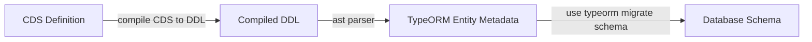

# cds mysql

[](https://www.npmjs.com/package/cds-mysql)

[](https://github.com/Soontao/cds-mysql/actions/workflows/tidb.yml)
[](https://github.com/Soontao/cds-mysql/actions/workflows/database.yml)
[](https://codecov.io/gh/Soontao/cds-mysql)

[](https://sonarcloud.io/dashboard?id=Soontao_cds-mysql)
[](https://sonarcloud.io/dashboard?id=Soontao_cds-mysql)
[](https://sonarcloud.io/dashboard?id=Soontao_cds-mysql)


> `MySQL`/`MariaDB`/`TiDB` adapter for [SAP CAP Framework](https://cap.cloud.sap/docs/about/), inspired by [cds-pg](https://github.com/sapmentors/cds-pg).

## Features

- [x] basic `INSERT`/`UPDATE`/`DELETE`/`SELECT` query support
- [x] deep insert for association/composition
  - [ ] deep update/delete test case
- [x] full text search
- [x] deploy & schema migration
- [x] migration optimization (ignore drop in some case)
  - [ ] ignore column length reduce and with warning
  - [ ] model version, only incremental migration
  - [ ] using `LinkedModel` element information for database migration
- [x] [`@Core.Media` attachment support](https://cap.cloud.sap/docs/guides/generic#serving-media-data)
- [x] [localized data](https://cap.cloud.sap/docs/guides/localized-data) with `sqlite` dialect
- [ ] multi tenancy
  - [x] deploy model on-fly
  - [x] create database on-demand
    - [ ] permission check
    - [ ] test
    - [x] migrate CSV on-demand (with option)
      - [x] CSV aspect `preDelivery`
      - [x] CSV migration with hash check
  - [ ] dynamic database credential provider
  - [ ] admin database concept
    - [ ] `@admin` tenant entity & services
  - [ ] tenant credential refresh
  - [ ] documentation
- [x] `$expand` navigation
- [x] `$filter` with functions
- [x] test with `mariadb 10.4`, `mysql 5.6/5.7/8`, `TiDB`
- [x] initial data provision by `CSV`
  - [x] better migration type/column/name adaption
- [x] auto incremental key aspect (odata only, single records)
- [x] mysql index
  - [ ] better error for not supported elements
- [x] automatically schema sync (when create pool)
  - [ ] sync data model online
  - [ ] sync CSV data when model changed
- [ ] better E2E document/sample


## Setup

put the `default-env.json` file into the root directory of your CAP project, with `mysql` credential information.

please **NOTICE** that, the `{ tags: ['mysql'] }` is the key which used for service credential lookup in CAP framework.

for the supported options in `credentials` node, just ref the [mysql official connection options document](https://www.npmjs.com/package/mysql#connection-options)

```json
{
  "VCAP_SERVICES": {
    "user-provided": [
      {
        "label": "user-provided",
        "name": "remote-mysql-service",
        "tags": [
          "mysql"
        ],
        "credentials": {
          "host": "mysql.host.name.com",
          "user": "user",
          "password": "cdsPas$w0rd",
          "database": "test",
          "port": 3306
        }
      }
    ]
  }
}
```

edit your `package.json` > `cds` node

```json5
{
  "requires": {
    "db": {
      "kind": "mysql"
      // add 'dialect' if you want to let the `localized` elements work
      // "dialect": "sqlite" 
    },
    "mysql": {
      "impl": "cds-mysql"
    }
  }
}
```

## Usage

> some advanced usage

### Auto Incremental Key Aspect

> define entity with `incrementalID` aspect to support the `AUTO_INCREMENT` syntax in `mysql` db

> **NOT COMPATIBLE** with deep composition/association operations

```groovy
using {incrementID} from 'cds-mysql';

// the entity `Animal` will have an auto-filled 'ID' field 
// ONLY support single record insert
entity Animal : incrementID {
  Name : String(255);
}
```


### CSV Migration

`cds-mysql` has a built-in csv migrator, it will migrate data with key validation.

- if key of entity is existed, skip
- if key of entity not existed, insert (if the records has been deleted, its also will be inserted)

> csv migrator will automatically fill the `PreDelivery` field as `true`
> for business, if user want to delete some data, just set the `Disabled` field as `true`

```groovy
using {incrementalKey, preDelivery} from 'cds-mysql';

entity Person : incrementalKey, preDelivery {
  Name : String(255);
}
```

### Add Column Index

> define entity with mysql built-in index

```groovy
@cds.typeorm.config : {indices : [{
  name    : 'ProductName', // key name
  columns : ['Name'] // index fields
}]}
entity Product : cuid {
  Name  : TranslatedText;
  Price : Decimal(10, 2);
}
```

### Configurations

> you can specify the configuration of `cds-mysql` at the `cds.requires.db` node

```json
{
  "cds": {
    "requires": {
      "db": {
        "kind": "mysql",
        "dialect": "sqlite",
        "csv": { "migrate": false },
        "tenant": {
          "deploy": {
            "eager": [ "default" ]
          }
        }
      },
      "mysql": { "impl": "cds-mysql" }
    }
  }
}
```

> interface

```ts
interface MysqlDatabaseOptions {
  tenant?: {
    deploy?: {
      /**
       * auto migrate database schema when connect to it
       */
      auto?: boolean;
      /**
       * eager deploy tenant id list 
       * the migration of those tenants will be performed when server startup
       */
      eager?: Array<string> | string;
    };
    /**
     * tenant database name prefix
     */
    prefix?: string;
  };
  /**
   * connection pool options
   */
  pool?: PoolOptions;
  csv?: {
    /**
     * migrate CSV on deployment
     */
    migrate?: boolean;
  };
}
```

### Setup Database Credential for Cloud Foundry

> if you want to run cds-mysql on cloud foundry

create mysql service by [`cf cups`](http://cli.cloudfoundry.org/en-US/cf/create-user-provided-service.html) with following format

```bash
cf cups remote-mysql-service -t 'mysql' -p '{"host":"public.mysql.instance.com","user":"cds-user","password":"CdsUser123$","database":"cds-user","port":3306,"ssl":{"ca":"-----BEGIN CERTIFICATE-----\n ......\n-----END CERTIFICATE-----\n"}}'
```

you can convert PEM cert to json format with [this document](https://docs.vmware.com/en/Unified-Access-Gateway/2.9/com.vmware.access-point-29-deploy-config/GUID-870AF51F-AB37-4D6C-B9F5-4BFEB18F11E9.html), just run command

```bash
awk 'NF {sub(/\r/, ""); printf "%s\\n",$0;}' cert-name.pem
```

### Schema Migration

`cds-mysql` will use the `cds compiler` to generate `DDL` SQL statements, parse the `DDL` statements and convert it to `typeorm`-`EntitySchema` objects, then do the migration with `typeorm`.




It will be fully automatically, sync changed `columns`, `views`.

It will **NEVER** drop old `tables`/`columns`, it will be **SAFE** in most cases.


## Compatibility Table

| @sap/cds version | cds-mysql version |
|------------------|-------------------|
| 5.8.x            | 5.9.x             |
| 5.9.x            | 5.9.x             |

## Limitation

- mysql 5.6 not support key length exceed 767 bytes
- `date` column not support default `$now`
- upload attachment maybe will meet `max_allowed_packet` issue, [it can be configured on server side](https://dev.mysql.com/doc/refman/8.0/en/packet-too-large.html). (default is `1MB`)
- The internal representation of a MySQL table has a maximum row size limit of `65,535` bytes.
- The default `varchar(5000)` will be converted to unlimited `text` type, so, **DO NOT** remember add length for the unlimited `String` fields.
- The `Boolean` type is represented as `TINYINT(1)` in mysql server, as a result, `boolean default true/false` will be converted to `TINYINT DEFAULT 1/0`.
- The `incrementId` aspect could not works well with `managed composition` because mysql do not support `composite primary key` contains an `auto_increment` column

## [CHANGELOG](./CHANGELOG.md)

## [LICENSE](./LICENSE)
