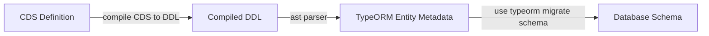

# Advanced Document

- [Advanced Document](#advanced-document)
  - [Concepts](#concepts)
    - [Compatibility Table](#compatibility-table)
    - [Configurations Overview](#configurations-overview)
    - [Built-In Data Type](#built-in-data-type)
  - [Tips and FAQ](#tips-and-faq)
    - [UPSERT](#upsert)
    - [CREATE and DROP CQN are disabled](#create-and-drop-cqn-are-disabled)
    - [Large Blob Storage](#large-blob-storage)
    - [Schema Migration](#schema-migration)
    - [Multi Tenancy](#multi-tenancy)
    - [Auto Incremental Key Aspect](#auto-incremental-key-aspect)
    - [CSV Migration](#csv-migration)
    - [Add Column Index](#add-column-index)
  - [Configuration](#configuration)
    - [config database credential by environments variables](#config-database-credential-by-environments-variables)
    - [config database credential by file](#config-database-credential-by-file)
    - [Setup Database Credential for Cloud Foundry](#setup-database-credential-for-cloud-foundry)
  - [Database](#database)
    - [Database User](#database-user)


## Concepts

### Compatibility Table

must use proper version of `cds-mysql` with `@sap/cds` sdk

| @sap/cds version | cds-mysql version |
| ---------------- | ----------------- |
| 5.8.x            | 5.9.x             |
| 5.9.x            | 5.9.x             |
| 6.0.x            | 6.0.x             |
| 6.1.x            | 6.1.x             |
| 6.2.x            | 6.2.x             |
| 6.3.x            | 6.3.x             |

### Configurations Overview

> you can specify the configuration of `cds-mysql` at the `cds.requires.db` node

```json
{
  "cds": {
    "requires": {
      "db": {
        "kind": "mysql",
        "csv": { "migrate": false },
        "tenant": {
          "deploy": {
            "eager": ["default"]
          }
        }
      },
      "mysql": { "impl": "cds-mysql" }
    }
  }
}
```

> interface

```ts
interface MysqlDatabaseOptions {
  tenant?: {
    deploy?: {
      /**
       * auto migrate database schema when connect to it
       * default value is `true`
       * specify `false` to disable the migration on startup/connection pool setup
       */
      auto?: boolean;
      /**
       * eager deploy tenant id list
       * the migration of those tenants will be performed when server startup
       */
      eager?: Array<string> | string;
    };
    /**
     * tenant database name prefix
     */
    prefix?: string;
  };
  /**
   * mysql connection configurations
   */
  connection?: {
    /**
     * `max_allowed_packet` size of mysql database, when create the pool of tenant, `cds-mysql` will try to set the global `max_allowed_packet` variable
     *
     * The value should be a multiple of 1024; non-multiples are rounded down to the nearest multiple.
     */
    maxallowedpacket?: number | boolean;
  };
  /**
   * connection pool options
   */
  pool?: PoolOptions;
  csv?: {
    /**
     * migrate CSV on deployment
     */
    migrate?: boolean;
  };
}
```

### Built-In Data Type

| CDS Type       | MySQL Type       |
| -------------- | ---------------- |
| UUID           | NVARCHAR(36)     |
| Boolean        | BOOLEAN          |
| UInt8          | TINYINT          |
| Int16          | SMALLINT         |
| Int32          | INTEGER          |
| Integer        | INTEGER          |
| Int64          | BIGINT           |
| Integer64      | BIGINT           |
| Decimal        | DECIMAL          |
| Double         | DOUBLE           |
| Date           | DATE             |
| Time           | TIME             |
| DateTime       | TIMESTAMP        |
| Timestamp      | TIMESTAMP        |
| String(LENGTH) | NVARCHAR(LENGTH) |
| String         | TEXT             |
| Binary         | VARBINARY        |
| LargeBinary    | LONGBLOB         |
| LargeString    | LONGTEXT         |

## Tips and FAQ

### UPSERT

> support `UPSERT` with mysql `INSERT ... ON DUPLICATE KEY UPDATE` feature

```js
const { UPSERT } = require("cds-mysql");

module.exports = class DemoService extends cds.ApplicationService {
  async _upsert(req) {
    const { Products } = this.entities;
    const { data } = req;
    return this.run(UPSERT().into(Products).entries(data));
  }
};
```

### CREATE and DROP CQN are disabled

> `CREATE` and `DROP` ql are **disabled** by `cds-mysql`.

it means:

```js
cds.run(CREATE.entity(def)); // with throw error 'ERROR_NOT_SUPPORT_CQN_CREATE'
```

### Large Blob Storage

if you have the `blob` column and try to upload large file/binary, maybe will encounter the `ER_NET_PACKET_TOO_LARGE` server side error, you can [configure](https://dev.mysql.com/doc/refman/8.0/en/packet-too-large.html) the `max_allowed_packet` in server side, or configure the global variable by `cds-mysql` (will be restore after mysql restart)

```json
{
  "cds": {
    "requires": {
      "db": {
        "kind": "mysql",
        "connection": {
          "maxallowedpacket": "104857600" // 100 MB
        }
      },
      "kinds": {
        "mysql": {
          "impl": "cds-mysql"
        }
      }
    }
  }
}
```

### Schema Migration

`cds-mysql` will use the `cds compiler` to generate `DDL` SQL statements, then parse the `DDL` statements, and convert them into `typeorm`-`EntitySchema` objects, then do the migration with `typeorm` existed migration functionality.



It will be fully automatically, sync changed `columns`, `views`.

It will **NEVER** drop old `tables`/`columns`, it will be **SAFE** in most cases.

> `cds-mysql` will automatically migrate schema and pre-defined CSV data into database when connecting to database (generally it means server received the first request which need database operation).

> just specify the `requires.db.tenant.deploy.eager` to sync schema (of target tenants) at startup

```json
{
  "cds": {
    "requires": {
      "db": {
        "tenant": {
          "deploy": {
            "eager": ["default", "<a-tenant-id here>"]
          }
        }
      }
    }
  }
}
```

### Multi Tenancy

> Out-of-Box multi-tenancy support

- develop the single tenant application, use the `default` as tenant id
- develop the multi-tenancy application, fill the `User.tenant` information for each `request`/`event`, and `cds-mysql` will automatically sync schema/CSV and provision connection pool for that tenant
  - data isolation in mysql database level, each tenant will own its own `database`
  - better to create a `admin` user to `cds-mysql` so that `cds-mysql` could help you to create `database`

### Auto Incremental Key Aspect

> define entity with `incrementalID` aspect to support the `AUTO_INCREMENT` syntax in `mysql` db

> **NOT COMPATIBLE** with deep composition/association operations, its better to use the `@sap/cds/common - cuid` aspect for deep operations

```groovy
using {incrementID} from 'cds-mysql';

// the entity `Animal` will have an auto-filled 'ID' field
// ONLY support single record insert
entity Animal : incrementID {
  Name : String(255);
}
```

### CSV Migration

`cds-mysql` has a built-in csv migrator, it will migrate data with key validation.

- if key of entity is existed, skip
- if key of entity not existed, insert (if the records has been deleted, its also will be inserted)

> csv migrator will automatically fill the `PreDelivery` field as `true`
> for business, if user want to delete some data, just set the `Disabled` field as `true`
> content hash will be checked before provisioned, if one file has been filled before, `cds-mysql` will skip processing it.

```groovy
using {incrementID, preDelivery} from 'cds-mysql';

entity Person : incrementID, preDelivery {
  Name : String(255);
}
```

### Add Column Index

> define entity with mysql built-in index

```groovy
@cds.typeorm.config : {indices : [{
  name    : 'ProductName', // key name
  columns : ['Name'] // index fields
}]}
entity Product : cuid {
  Name  : TranslatedText;
  Price : Decimal(10, 2);
}
```

## Configuration

### config database credential by environments variables

> as CAP supported, developer could also use `environments` to configure the database credential

```bash
CDS_REQUIRES_DB_CREDENTIALS_USER=cds_admin
CDS_REQUIRES_DB_CREDENTIALS_PASSWORD=cds_admin
CDS_REQUIRES_DB_CREDENTIALS_DATABASE=cds_admin
CDS_REQUIRES_DB_CREDENTIALS_HOST=127.0.0.1
CDS_REQUIRES_DB_CREDENTIALS_PORT=3306
```

### config database credential by file

create a `default-env.json` file into the root directory of your CAP project, it will be useful if you want to put some details information of mysql driver

for more supported options in `credentials` node, please ref the [mysql official connection options document](https://www.npmjs.com/package/mysql#connection-options)


```json
{
  "VCAP_SERVICES": {
    "user-provided": [
      {
        "label": "user-provided",
        "name": "remote-mysql-service",
        "tags": ["mysql"],
        "credentials": {
          "host": "mysql.host.name.com",
          "user": "user",
          "password": "cdsPas$w0rd",
          "database": "test",
          "port": 3306
        }
      }
    ]
  }
}
```

### Setup Database Credential for Cloud Foundry

> if you want to run cds-mysql on cloud foundry for production

create mysql service by [`cf cups`](http://cli.cloudfoundry.org/en-US/cf/create-user-provided-service.html) with following format

```bash
cf cups remote-mysql-service -t 'mysql' -p '{"host":"public.mysql.instance.com","user":"cds-user","password":"CdsUser123$","database":"cds-user","port":3306,"ssl":{"ca":"-----BEGIN CERTIFICATE-----\n ......\n-----END CERTIFICATE-----\n"}}'
```

you can convert PEM cert to json format with [this document](https://docs.vmware.com/en/Unified-Access-Gateway/2.9/com.vmware.access-point-29-deploy-config/GUID-870AF51F-AB37-4D6C-B9F5-4BFEB18F11E9.html), just run command

```bash
awk 'NF {sub(/\r/, ""); printf "%s\\n",$0;}' cert-name.pem
```

## Database 

### Database User

for the database user which configured in credential, at least it should have the permission to perform SQL and DML.

if the `multi-tenancy` or `mtxs` is enabled, the user need the permission to `CREATE/DROP DATABASE` and other DDL permission.
